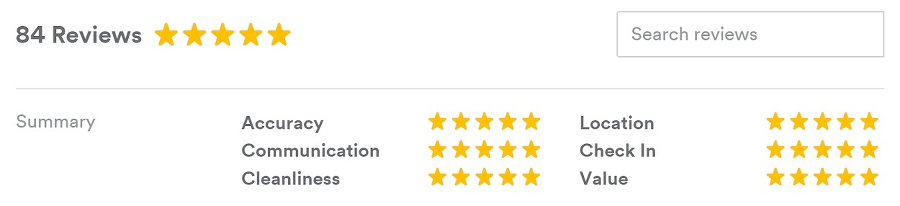

**Design a review system for retailer**  

User should be able to add review text for a product  
User should be able to provide overall rating for the product  
Users should be able to see the summary of ratings  
Users should be able to review different features of the product and rate them separately  
Users should be able to add images of the product which is being reviewed
Users should be able to filter reviews based on the below  
 1. My reviews
 2. Get By product
 3. Get reviews by feature
 4. Top rated reviews
 5. Reviews by date asc and desc
 6. Get certified reviews
 7. Get reviews having images

Users review moderation status updation and notifying users based on the state.

